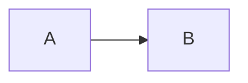

## Columns

Use Columns to place short, related content side by side.

```go-html

Left column
<--->
Right column

```


Left column
<--->
Right column


## Hints

```go-html
{}
Read this before deploying.
{}
```

{}
Read this before deploying.
{}

## Tabs

```go-html

{} npm install {}
{} pnpm install {}

```


{} npm install {}
{} pnpm install {}


## Details

```go-html
{}
Additional explanation goes here.
{}
```

{}
Additional explanation goes here.
{}

## Mermaid

````markdown

````


## KaTeX

````markdown
```katex
E = mc^2
```
````

```katex
E = mc^2
```

Use `$E = mc^2$` for inline math.
