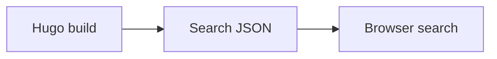

## Mermaid

````markdown

````


Use Mermaid when a diagram explains a flow more clearly than a long paragraph.

## KaTeX

````markdown
```katex
E = mc^2
```
````

```katex
E = mc^2
```

Inline math uses `$E = mc^2$`.

SeoTax includes Mermaid and KaTeX resources,
so these features do not require a separate CDN configuration.
