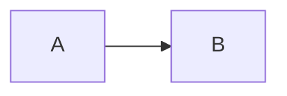

## Columns

짧은 내용을 여러 열로 나눌 때 사용합니다.

```go-html

왼쪽 내용
<--->
오른쪽 내용

```


왼쪽 내용
<--->
오른쪽 내용


## Hints

정보, 경고, 성공 메시지를 강조할 때 사용합니다.

```go-html
{}
주의할 내용을 작성합니다.
{}
```

{}
주의할 내용을 작성합니다.
{}

지원 스타일은 `info`, `success`, `warning`, `danger`입니다.

## Tabs

같은 주제의 코드를 언어별로 나눌 때 좋습니다.

```go-html

{} npm install {}
{} pnpm install {}

```


{} npm install {}
{} pnpm install {}


## Details

길거나 보조적인 내용을 접어둘 수 있습니다.

```go-html
{}
숨겨둘 설명
{}
```

{}
숨겨둘 설명
{}

## Mermaid와 KaTeX

다이어그램은 Mermaid, 수식은 KaTeX를 사용합니다.

````markdown

````


